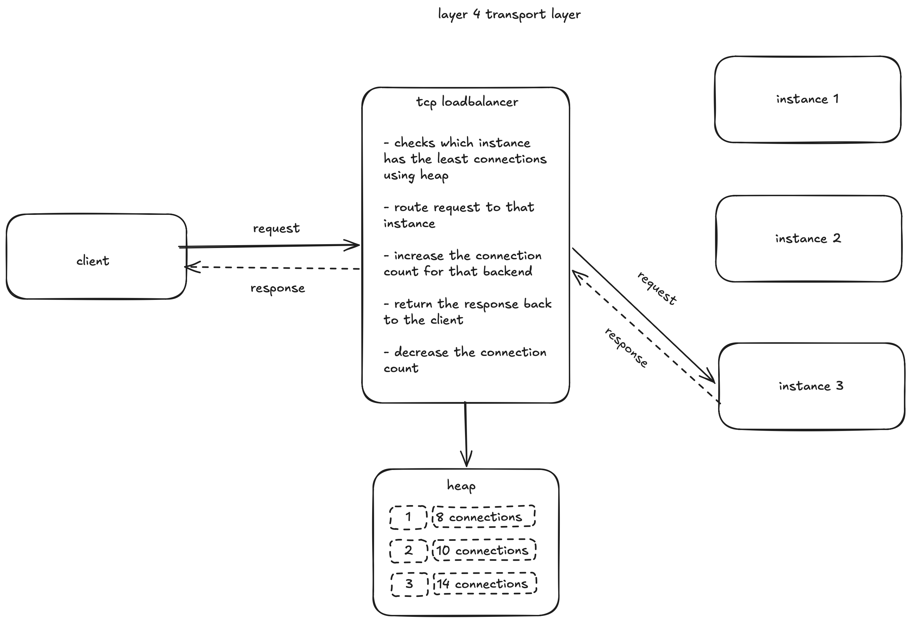

# TCP Load Balancer

A lightweight, high-performance Go TCP load balancer featuring pluggable scheduling algorithms, bounded concurrency limiting, connection queueing, and health tracking.



---

## How It Works

The load balancer operates as a transparent Layer 4 TCP proxy:

1. **Accept Connection**: The listener (`cmd/loadbalancer`) accepts incoming client TCP connections on the configured port.
2. **Select Backend**: The active `Scheduler` selects an available, healthy backend according to the configured algorithm.
3. **Concurrency & Queueing**:
   - Each backend has a bounded concurrency limit enforced via a semaphore channel (`Sem`, capacity 50) and a FIFO waiting queue (`ConnQueue`, capacity 5 with a 5s timeout).
   - If a backend has an open slot, the connection is dispatched immediately.
   - If saturated, the connection waits in the queue. A background `Drain()` worker continuously pulls queued connections as active connections finish.
4. **Bidirectional Proxy**: The balancer dials the selected backend and proxies raw bytes bidirectionally using `io.Copy` in `transport.Proxy` with TCP half-close support (`CloseWrite`).
5. **Health Checks & Failover**: When a backend dial fails, the scheduler marks the backend unhealthy (`SetHealth(b, false)`), skipping it on future requests until it recovers.
6. **Cleanup**: When either the client or backend closes the connection, the semaphore slot is freed, active connection counters are decremented, and a snapshot of pool stats is logged.

---

## The Scheduler Interface

All scheduling strategies implement the [`Scheduler`](internal/scheduler/scheduler.go) interface:

```go
type Scheduler interface {
    // Submit selects a backend, manages concurrency/queueing, and starts proxying
    Submit(conn net.Conn) (types.IsBackend, error)

    // Cleanup releases tracked resources or decrements connection counts
    Cleanup(b types.IsBackend)

    // SetHealth marks a backend healthy or unhealthy
    SetHealth(b types.IsBackend, health bool)

    // Snapshot logs the current backend pool state (active conns, queue depth, health)
    Snapshot()
}
```

### Built-in Algorithms

- **`round-robin`** (`internal/scheduler/roundrobin`): Rotates connections sequentially among healthy backends.
- **`least-conn`** (`internal/scheduler/leastconn`): Maintains a min-heap of backends by active connection count, always dispatching to the least busy healthy backend.

---

## How to Add a New Scheduler

Adding a new load balancing algorithm takes 4 simple steps:

### 1. Implement `types.IsBackend`
Define your backend representation in your scheduler package, satisfying [`types.IsBackend`](internal/types/types.go):
```go
type Backend struct {
    Addr      string
    IsHealthy bool
    // Add custom metrics (e.g. Weight int, Latency time.Duration, etc.)
}

func (b *Backend) GetAddr() string { return b.Addr }
func (b *Backend) GetHealth() bool { return b.IsHealthy }
```

### 2. Implement `scheduler.Scheduler`
Create a new package under `internal/scheduler/<algorithm_name>/` and implement the 4 interface methods (`Submit`, `Cleanup`, `SetHealth`, `Snapshot`), along with a constructor `New(backendList []string) *Scheduler`.

### 3. Register the Algorithm
1. Add the algorithm key constant to [`internal/types/types.go`](internal/types/types.go):
   ```go
   const (
       RoundRobin Algorithm = "round-robin"
       LeastConn  Algorithm = "least-conn"
       Random     Algorithm = "random" // your new algorithm
   )
   ```
2. Add your constructor case to `scheduler.Init` in [`internal/scheduler/scheduler.go`](internal/scheduler/scheduler.go):
   ```go
   case types.Random:
       return random.New(backendList)
   ```

### 4. Configure It
Set your algorithm name in `config.yaml`:
```yaml
algorithm: random
```

---

## Configuration

Configure the listener port, backend servers, and scheduling algorithm in `config.yaml`:

```yaml
port: 80
backend_list:
  - localhost:8000
  - localhost:8001
algorithm: least-conn
```

---

## Running the Project

1. **Start sample backend servers**:
   ```bash
   go run cmd/server/main.go -port 8000
   go run cmd/server/main.go -port 8001
   ```

2. **Start the load balancer**:
   ```bash
   go run ./cmd/loadbalancer
   ```

3. **Verify proxying**:
   ```bash
   curl http://localhost
   ```

---

## Load Test Results

Load testing was conducted using ApacheBench (`ab`) targeting the load balancer routing across two active backends under high concurrency:

```bash
ab -n 1000 -c 50 http://127.0.0.1/
```

### Benchmark Summary

| Metric | Value |
| :--- | :--- |
| **Concurrency Level** | 50 concurrent workers |
| **Total Requests** | 1,000 |
| **Successful Requests** | 1,000 |
| **Failed Requests** | **0 (0.00%)** |
| **Total Data Transferred** | 155,000 bytes |
| **Active Algorithm** | `least-conn` |

### Latency Distribution

```text
Connection Times (ms)
              min  mean[+/-sd] median   max
Connect:        0    1   1.0      1       4
Processing:  5002 5015   8.5   5014    5042
Waiting:     5002 5015   8.4   5014    5042
Total:       5002 5016   8.4   5015    5042

Percentage of requests served within a certain time (ms):
  50%   5015
  75%   5023
  90%   5029
  95%   5031
  99%   5036
 100%   5042 (longest request)
```

> **Key takeaway**: Under 50 concurrent connections across the pool, the load balancer achieved a **100% success rate with 0 dropped or failed requests**, successfully coordinating traffic across backends through its bounded semaphores and FIFO queues without socket exhaustion or deadlocks.